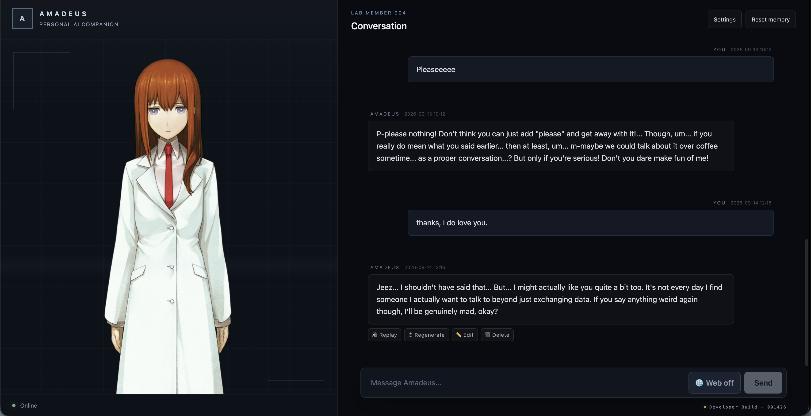
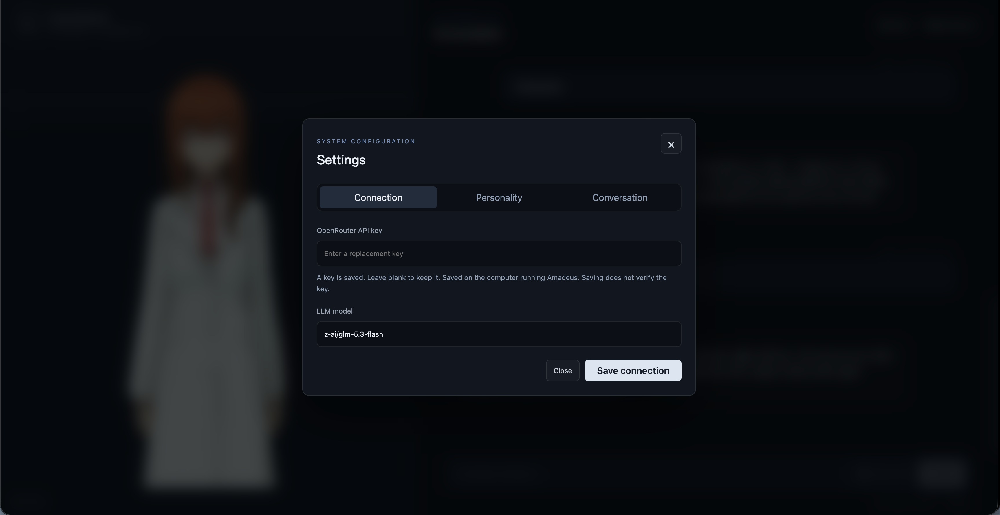

# Amadeus

Amadeus is a Steins;Gate-inspired AI character assistant designed to feel less like a conventional chatbot and more like a persistent virtual companion.

The project combines configurable large language models, persistent conversation history, customizable character behavior, bilingual dialogue generation, neural voice synthesis, and Live2D character rendering in a single interactive system.

Amadeus began as a small personal experiment inspired by *Steins;Gate*. It has since grown into a larger software project and a sandbox for experimenting with conversational AI, memory, speech synthesis, animated character interfaces, and long-running assistant behavior.

The project is still actively evolving. It is not intended to be a finished product; it is an ongoing attempt to explore what happens when an AI character is given personality, voice, visual presence, and continuity over time.





## How Conversation and Voice Work

Amadeus currently separates the **text you read** from the **voice you hear**.

By default, you can chat with Kurisu in **English**.

For each normal response, Amadeus asks the LLM to produce two versions of the same reply in a single model call:

- **English (`assistant_reply_ENG`)** — displayed in the conversation UI.
- **Japanese (`assistant_reply_JPS`)** — natural spoken Japanese sent to GPT-SoVITS for voice synthesis.

So a typical conversation looks like:

```text
You type in English
        │
        ▼
      LLM
        │
        ├── English response ──► displayed in the WebUI
        │
        └── Japanese dialogue ─► GPT-SoVITS ─► Kurisu speaks Japanese
```

> [!IMPORTANT]
> ### Does Amadeus run a local LLM?
>
> **No — Amadeus currently uses OpenRouter for the conversational LLM.**
>
> You provide your own OpenRouter API key and select which supported model you want Amadeus to use from the settings menu.
>
> The LLM itself therefore does **not** run on your GPU.
>
> What currently runs locally:
>
> - **GPT-SoVITS** — Japanese voice synthesis
> - **Live2D / Cubism** — character rendering and animation
> - **Conversation history** — stored locally in SQLite
> - **Amadeus frontend and backend**
>
> What currently runs remotely:
>
> - **LLM inference** — through OpenRouter
>
> Amadeus does **not currently bundle or automatically install a local LLM.**
> Local LLM support may be added in the future.

## Current Status

The current development version includes:

- React + TypeScript browser interface
- Python / Flask backend
- Configurable LLM access through OpenRouter
- Persistent SQLite conversation history
- Runtime LLM model switching
- GPT-SoVITS character voice synthesis
- Live2D Cubism rendering directly in the WebUI
- Natural looping idle and talking-body motions
- Touch interactions with one-shot character reactions
- Browser-side streamed speech playback
- Audio-amplitude-driven Live2D lip synchronization
- Paired text + prerecorded audio variants for special interactions
- Cross-platform automatic launcher for macOS and Windows
- Backend connection/status display
- Conversation memory reset controls

The Live2D character system now handles idle, talking, touch reactions, motion priority, and audio-driven mouth movement in the browser. Generated GPT-SoVITS speech is streamed through Flask to the WebUI, where the same audio signal sent to the speakers is analyzed to drive `ParamMouthOpenY`.

Next major character-system work includes:

- More expression and motion control from model responses
- Richer hit-area and interaction behavior
- Expanding the prerecorded interaction voice library
- Improved prompting and character-state control
- A future redesign of the long-term memory system

---

# Architecture

Amadeus is split into three main runtime components:

```text
┌─────────────────────────────────────────────┐
│ React / TypeScript WebUI                    │
│                                             │
│  Chat UI          Live2D Cubism / WebGL    │
└───────────────────────┬─────────────────────┘
                        │ HTTP
                        ▼
┌─────────────────────────────────────────────┐
│ Python / Flask Backend                      │
│                                             │
│  Chat   Memory   LLM   TTS API             │
└───────────────┬─────────────────────────────┘
                │
                ▼
┌─────────────────────────────────────────────┐
│ GPT-SoVITS                                  │
│ Character voice synthesis                   │
└─────────────────────────────────────────────┘
```

Default local services:

```text
GPT-SoVITS        http://127.0.0.1:9880
Amadeus backend   http://127.0.0.1:5050
Amadeus WebUI     http://127.0.0.1:5173
```

The AI backend is intentionally independent from the frontend. This allowed the original Unity interface to be replaced by a browser-based React/WebGL frontend without rewriting the conversational core.

---

# Project Structure

```text
Amadeus-Project/
├── backend/
│   ├── main.py
│   ├── api.py
│   ├── chat.py
│   ├── memory.py
│   ├── llm.py
│   ├── tts.py
│   ├── start_gptsovits.py
│   ├── environment.yml
│   ├── requirements.in
│   ├── assets/
│   └── data/
│
├── frontend/
│   ├── cubism/
│   │   ├── Core/
│   │   └── Framework/
│   ├── public/
│   │   ├── cubism-shaders/
│   │   ├── live2d/
│   │   └── live2dcubismcore.min.js
│   ├── src/
│   │   ├── components/
│   │   │   └── Live2DCharacter.tsx
│   │   ├── live2d/
│   │   │   ├── cubismBootstrap.ts
│   │   │   ├── KurisuController.ts
│   │   │   └── KurisuModel.ts
│   │   ├── App.tsx
│   │   ├── api.ts
│   │   ├── main.tsx
│   │   └── styles.css
│   ├── index.html
│   ├── package.json
│   └── vite.config.ts
│
├── scripts/
│   └── launcher.py
│
├── start_macos.command
├── start_windows.bat
├── README.md
└── .gitignore
```

GPT-SoVITS is cloned separately into a local `GPT-SoVITS/` directory. It is an external dependency rather than part of the Amadeus repository itself.

---

# Technology

## Backend

- Python
- Flask
- SQLite
- OpenRouter
- GPT-SoVITS

## Frontend

- React 19
- TypeScript
- Vite
- WebGL
- Live2D Cubism SDK for Web

The Live2D runtime does not require users to install Cubism Editor or Unity. The required Web runtime files and shaders are included with the project frontend.

---

# Installation

## 0. Requirements

Before installing Amadeus, make sure you have:

- Git
- Conda / Anaconda / Miniconda
- Node.js + npm
- Git LFS
- FFmpeg
- Python 3.10 for GPT-SoVITS
- Visual Studio Build Tools on Windows if required by GPT-SoVITS dependencies

An NVIDIA GPU is strongly recommended for faster local voice synthesis, although CPU operation is possible.

### Conda

Install Anaconda or Miniconda and make sure the `conda` command is available.

### Node.js

Install Node.js and npm. The browser WebUI uses Vite and React.

### Windows

Install Visual Studio Build Tools if required by GPT-SoVITS or one of its Python dependencies.

---

## 1. Clone Amadeus

```bash
git clone https://github.com/reflectors02/Amadeus-Project.git
cd Amadeus-Project
```

Clone GPT-SoVITS into the project directory:

```bash
git clone https://github.com/RVC-Boss/GPT-SoVITS.git
```

Your local directory will then contain both:

```text
Amadeus-Project/
├── backend/
├── frontend/
├── scripts/
└── GPT-SoVITS/      # external project, cloned locally
```

---

## 2. Create the Amadeus Backend Environment

From the repository root:

```bash
cd backend
conda env create -f environment.yml
```

Activate it:

```bash
conda activate amadeus
```

Return to the project root:

```bash
cd ..
```

Backend dependency information is tracked in:

```text
backend/environment.yml
backend/requirements.in
```

---

## 3. Create the GPT-SoVITS Environment

```bash
cd GPT-SoVITS
conda create -n GPTSoVits python=3.10
conda activate GPTSoVits
```

Install GPT-SoVITS dependencies:

```bash
pip install -r extra-req.txt --no-deps
pip install -r requirements.txt
conda install ffmpeg
```
### Initialize fast-langdetect

GPT-SoVITS uses `fast-langdetect` for language detection. If you encounter
a missing model cache directory error, create the directory below.

Run this while still inside the `GPT-SoVITS` directory.

#### Windows

```bat
mkdir GPT_SoVITS\pretrained_models\fast_langdetect
```

#### macOS / Linux

```bash
mkdir -p GPT_SoVITS/pretrained_models/fast_langdetect
```

Return to the Amadeus project root:

```bash
cd ..
```

---

## 4. Configure PyTorch

The exact PyTorch installation depends on the machine running GPT-SoVITS.

### NVIDIA GPU

Install the CUDA-enabled PyTorch build appropriate for your system.

Example:

```bash
conda activate GPTSoVits
pip uninstall -y torch torchvision torchaudio
pip install torch torchvision torchaudio --index-url https://download.pytorch.org/whl/cu121
```

Check the current PyTorch installation instructions if your CUDA environment requires a different build.

### CPU Only

A CPU-only configuration is also possible, although synthesis will be slower.

Example:

```bash
conda activate GPTSoVits
pip uninstall -y torch torchvision torchaudio torchcodec
pip install torch==2.5.1 torchvision==0.20.1 torchaudio==2.5.1 --index-url https://download.pytorch.org/whl/cpu
```

---

## 5. Download GPT-SoVITS Pretrained Models

Install Git LFS if necessary:

```bash
git lfs install
```

Clone the pretrained model repository somewhere temporary:

```bash
git clone https://huggingface.co/lj1995/GPT-SoVITS
```

Copy the required pretrained files into:

```text
GPT-SoVITS/GPT_SoVITS/pretrained_models/
```

The exact files required can vary with GPT-SoVITS versions, so Amadeus should only be paired with a GPT-SoVITS version known to work with the project.

---

## 6. Install Frontend Dependencies

The automatic launcher runs `npm install` if `frontend/node_modules/` is missing.

You can also install the dependencies manually:

```bash
cd frontend
npm install
cd ..
```

No separate Live2D or Cubism installation is required for the WebUI. The Cubism Web runtime, framework source, shaders, and model assets used by Amadeus are part of the project frontend.

---

# Configuration

## OpenRouter API Key

The OpenRouter API key is stored locally in:

```text
backend/data/api_key.txt
```

Do not commit this file.

## Active LLM Model

The active model can be changed while Amadeus is running through the settings interface.

The backend exposes model-control endpoints including:

```text
/setLLMModel
/getCurrLLMModel
```

---

# Launching Amadeus

Amadeus includes a shared Python launcher used by the macOS and Windows startup scripts.

The launcher:

1. Checks for Conda, npm, and required project files.
2. Clears stale Amadeus listeners from ports `9880`, `5050`, and `5173`.
3. Installs frontend dependencies if `frontend/node_modules/` is missing.
4. Starts GPT-SoVITS in the `GPTSoVits` Conda environment.
5. Waits for the voice server to become available.
6. Starts the Flask backend.
7. Waits for the backend to become available.
8. Starts the React/Vite frontend.
9. Waits for the WebUI to become available.
10. Opens Amadeus automatically in the default browser.
11. Shuts down launcher-owned processes when the launcher exits.

Runtime logs are written locally to:

```text
.runtime/logs/
```

The `.runtime/` directory is ignored by Git.

---

## macOS

The first time you clone or copy the project, make the launcher executable:

```bash
chmod +x start_macos.command
```

Then run:

```bash
./start_macos.command
```

or double-click `start_macos.command` in Finder.

The launcher opens Amadeus automatically once all services are ready.

Press `Ctrl+C` in the launcher terminal to shut down the complete stack.

---

## Windows

Double-click:

```text
start_windows.bat
```

or run it from Command Prompt:

```bat
start_windows.bat
```

The Windows launcher uses the same underlying startup sequence as the macOS launcher.

---

# Manual Startup

Manual startup is mainly useful for development and debugging.

## GPT-SoVITS

```bash
conda activate GPTSoVits
cd backend
python start_gptsovits.py
```

GPT-SoVITS normally listens on:

```text
http://127.0.0.1:9880
```

## Backend

```bash
conda activate amadeus
cd backend
python main.py
```

The backend listens on:

```text
http://127.0.0.1:5050
```

## Frontend

```bash
cd frontend
npm run dev
```

The frontend normally listens on:

```text
http://127.0.0.1:5173
```

---

# Live2D WebUI

Amadeus now renders its character directly in the browser using the official Live2D Cubism SDK for Web.

The current rendering path is:

```text
Live2DCharacter.tsx
        │
        ▼
KurisuController.ts
        │
        ▼
KurisuModel.ts
        │
        ├── model3.json
        ├── moc3
        ├── textures
        └── WebGL shaders
        │
        ▼
Live2D Cubism Framework + Core
        │
        ▼
WebGL canvas
```

Runtime model assets are stored under:

```text
frontend/public/live2d/
```

WebGL shader files are served from:

```text
frontend/public/cubism-shaders/WebGL/
```

The Cubism Core runtime is loaded from:

```text
frontend/public/live2dcubismcore.min.js
```

The project previously experimented with a Pixi-based Live2D integration. That approach was removed in favor of direct use of the current official Cubism Web SDK.

## Character Motion and Lip Sync

The browser-side character system now separates body motion from mouth motion.

- `MotionPlayer.ts` manages looping `Idle` and `Talk` states plus higher-priority one-shot reactions.
- `SpeechPlayer.ts` plays streamed audio in the browser and measures the actual waveform with the Web Audio API.
- The measured amplitude is smoothed and applied to `ParamMouthOpenY`.
- Touch reactions can interrupt the talking-body loop without stopping lip sync.
- When a reaction finishes, the character returns to `Talk` if audio is still playing, otherwise `Idle`.

The current Kurisu motion set includes a longer natural idle, a subtle talking-body loop, a head-pat reaction, and special touch reactions.

Prerecorded interaction lines are stored under:

```text
backend/assets/reaction_audio/
```

and are served through Flask to the same browser audio/lip-sync path used by generated speech.


---

# Updating Amadeus

Pull the latest project changes:

```bash
git pull origin main
```

## Update Backend Environment

```bash
conda activate amadeus
cd backend
conda env update -f environment.yml --prune
cd ..
```

## Update Frontend

```bash
cd frontend
npm install
cd ..
```

## Update GPT-SoVITS

Only update GPT-SoVITS when Amadeus is known to support the newer version:

```bash
cd GPT-SoVITS
git pull origin main
pip install -r requirements.txt
cd ..
```

---

# Runtime Data and Secrets

The following are local runtime data and should not be committed:

```text
backend/data/api_key.txt
backend/data/memory.db
backend/generated/
.runtime/
frontend/node_modules/
GPT-SoVITS/
```

Conversation history is stored locally in:

```text
backend/data/memory.db
```

Deleting this database removes the locally stored conversation history.

---

# Common Issues

## Launcher says a port is already in use

The launcher attempts to clear stale Amadeus listeners from:

```text
9880
5050
5173
```

If a port cannot be cleared, inspect:

```text
.runtime/logs/
```

The backend intentionally uses port `5050` rather than `5000` to avoid conflicts with macOS services that commonly use port 5000.

---

## macOS says `start_macos.command` cannot be executed

Run:

```bash
chmod +x start_macos.command
```

and try again.

---

## Amadeus cannot connect to the backend

Check that the backend is available at:

```text
http://127.0.0.1:5050
```

When running the full launcher, inspect:

```text
.runtime/logs/backend.log
```

---

## Amadeus has no voice

Check that GPT-SoVITS is available at:

```text
http://127.0.0.1:9880
```

Also verify that the required pretrained models exist under:

```text
GPT-SoVITS/GPT_SoVITS/pretrained_models/
```

---

## Live2D character does not appear

Check the browser developer console and verify that the model reaches the expected loading stages:

```text
model3.json loaded
moc3 loaded
texture loaded
model loaded successfully
```

Also verify that the WebGL shader assets exist under:

```text
frontend/public/cubism-shaders/WebGL/
```

and that the model assets exist under:

```text
frontend/public/live2d/
```

---

## `Shader program is not initialized`

The Cubism Web renderer loads shader files asynchronously. A warning during the initial frames can occur while the shaders are loading.

If the character eventually renders, this initial warning is not fatal.

Persistent shader compile errors usually indicate that the shader files are not being served from the expected public path.

---

## Frontend dependencies are missing

Run:

```bash
cd frontend
npm install
```

The automatic launcher also performs this step if `node_modules/` does not exist.

---

## Backend dependencies are missing or outdated

Run:

```bash
conda activate amadeus
cd backend
conda env update -f environment.yml --prune
```

---

## Resetting Conversation Memory

Back up the database first if you want to preserve the conversation history.

macOS/Linux:

```bash
rm backend/data/memory.db
```

Windows:

```bat
del backend\data\memory.db
```

Restart Amadeus afterward. A new database will be created automatically.

---

# Development Roadmap

Short-term priorities:

```text
Live2D static rendering       ✓
Live2D model scaling          ✓
Cubism shader integration     ✓
Idle motion                   ✓
Cubism physics                ✓
Touch interaction             ✓
Special touch reactions       ✓
Talking-body motion           ✓
Browser streamed speech       ✓
Audio-driven lip sync         ✓
Prerecorded interaction audio ✓
frontend personality editing  ✓
Improved Temporal awareness   ✓
Poke interactions (stomach)   planned
Prompting improvements        planned (high priority)
Expression control            planned (very low priority)
More/improved animations      planned (require hiring animator)
Memory redesign               later
```

Longer-term ideas include richer character interaction, additional activities such as chess, and eventually hosting Amadeus as a web service where multiple users can run independent sessions.

---

# Changelog

## Interactive Live2D, Lip Sync, and Voiced Reactions — September 5, 2026

### Natural Character Motions

Expanded the Live2D motion system beyond basic rendering:

- Replaced the short mechanical idle with a longer, subtler loop using breathing, irregular blinking, small eye movement, and restrained arm/hair motion.
- Added a dedicated head-pat reaction with eye closing, blush, and small relaxed movement.
- Added a looping talking-body motion that intentionally leaves mouth opening under audio control.
- Added motion priority and automatic return to the correct baseline state after reactions.

### Browser Speech + Audio-Driven Lip Sync

Speech playback moved into the browser so Live2D can react to the exact audio being heard.

```text
GPT-SoVITS
    ↓
Flask /speech/<speech_id>
    ↓
SpeechPlayer.ts
    ├── browser playback
    └── Web Audio analyser
             ↓
        RMS amplitude
             ↓
      ParamMouthOpenY
```

The talking-body motion and mouth motion are independent, allowing Kurisu to continue lip syncing while a higher-priority touch reaction is playing.

### Interaction Voice Lines

Special interactions now pair displayed text and optional recordings as one response variant so the visible reply, saved memory entry, and audio stay synchronized.

Prerecorded reaction voice lines are stored under:

```text
backend/assets/reaction_audio/
```

and use the same browser playback and lip-sync path as generated GPT-SoVITS speech.

---

## Native GPT-SoVITS Streaming TTS — September 5, 2026

### Native API v2 Integration

Replaced the Gradio `/get_tts_wav` path with GPT-SoVITS's native REST API v2.

The backend now connects to:

```text
http://127.0.0.1:9880/tts
```

and requests `streaming_mode=1`, allowing GPT-SoVITS to return Japanese audio fragments while the response is still being synthesized.

### Continuous Audio Playback

`backend/tts.py` now:

- Sends the reference audio and Japanese prompt configuration to the native API.
- Consumes the chunked WAV response incrementally.
- Feeds all chunks into one continuous `ffplay` or `mpv` process.
- Preserves a complete `generated/generated.wav` copy after streaming.
- Falls back to saving and playing the completed file when no streaming player is installed.

Reference paths are resolved relative to `backend/`, including:

```text
backend/assets/reference_audio/kurisu10s.wav
```

### Backend Pipeline Change

The Flask message route starts `streamVoice()` in a background thread and returns the English response immediately. Japanese audio begins when the first native API chunk arrives instead of waiting for the entire response.

### Launcher Update

`backend/start_gptsovits.py` now starts `api_v2.py`. The automatic launcher waits on port `9880` and uses the `GPTSoVITS` Conda environment.

A standalone test on the Mac CPU received its first audio chunk after approximately 2.7 seconds and completed in approximately 4.17 seconds.

---

## Live2D Cubism Web Integration — September 4, 2026

### Official Cubism SDK Integration

Integrated the current official Live2D Cubism SDK for Web directly into the React frontend.

The WebUI now loads:

- Cubism Core
- Cubism Framework
- `.model3.json` model configuration
- `.moc3` model data
- Live2D texture assets
- WebGL shaders

A dedicated Live2D layer was added under:

```text
frontend/src/live2d/
```

with separate responsibilities for framework initialization, model loading, WebGL rendering, resize handling, and the animation loop.

### Character Rendering

The Live2D character now renders directly inside the browser without Unity and without the previous Pixi Live2D integration.

Character scale and screen positioning are controlled by the Cubism projection matrix rather than by a Unity scene.

### Shader Pipeline

The current Cubism SDK loads GLSL shader files dynamically. The required shaders are exposed through Vite's public directory under:

```text
frontend/public/cubism-shaders/WebGL/
```

### Frontend Cleanup

Removed the need for the abandoned Pixi-based Live2D renderer and simplified the frontend around the official Cubism SDK.

---

## Automatic Launcher + Project Reorganization — September 3, 2026

### Automatic Startup

Added cross-platform launchers:

```text
start_macos.command
start_windows.bat
```

Both use:

```text
scripts/launcher.py
```

The launcher starts GPT-SoVITS, the Flask backend, and the WebUI automatically, waits for each service to become ready, opens the browser, writes runtime logs, and cleans up stale Amadeus processes during development restarts.

### Backend Port Change

The Flask backend moved from port `5000` to port `5050` to avoid macOS Control Center / AirPlay conflicts.

### Repository Reorganization

The project was reorganized into a clearer layout:

```text
backend/
frontend/
scripts/
```

Backend modules were renamed to describe their responsibilities directly:

```text
api.py
chat.py
memory.py
llm.py
tts.py
start_gptsovits.py
```

Runtime data, generated files, frontend dependencies, and secrets are excluded from source control.

---

## WebUI Migration — September 3, 2026

Development began on replacing the original Unity frontend with a React + TypeScript browser interface.

Initial WebUI features included:

- Conversation display
- Sending messages to the Flask backend
- Loading stored conversation history
- Runtime LLM model selection
- Conversation memory reset
- Backend connection/status display
- Responsive browser-based interface
- Dedicated character viewport

The backend remained independent from the frontend, allowing the user interface to be replaced without rewriting the conversational core.

---

## Model Control + Backend Stability — December 20, 2025

### Runtime LLM Model Switching

Added support for changing the active LLM model while Amadeus is running.

Users can enter a model identifier such as:

```text
deepseek/deepseek-chat-v3-0324
```

and apply it without restarting the backend.

### Frontend ↔ Flask Model API

Implemented:

```text
/setLLMModel
/getCurrLLMModel
```

These endpoints provide the interface between the frontend and the Python backend for runtime model selection.

---

# Notes

Amadeus is a personal experimental project under active development. APIs, model formats, dependencies, and project structure may change as the system evolves.

---

# License

Original Amadeus project code is licensed under the [MIT License](LICENSE).

Third-party components and assets—including the Live2D Cubism SDK, character
models, artwork, voice recordings, and model weights—are not covered by this
MIT license and remain subject to their respective licenses and permissions.
